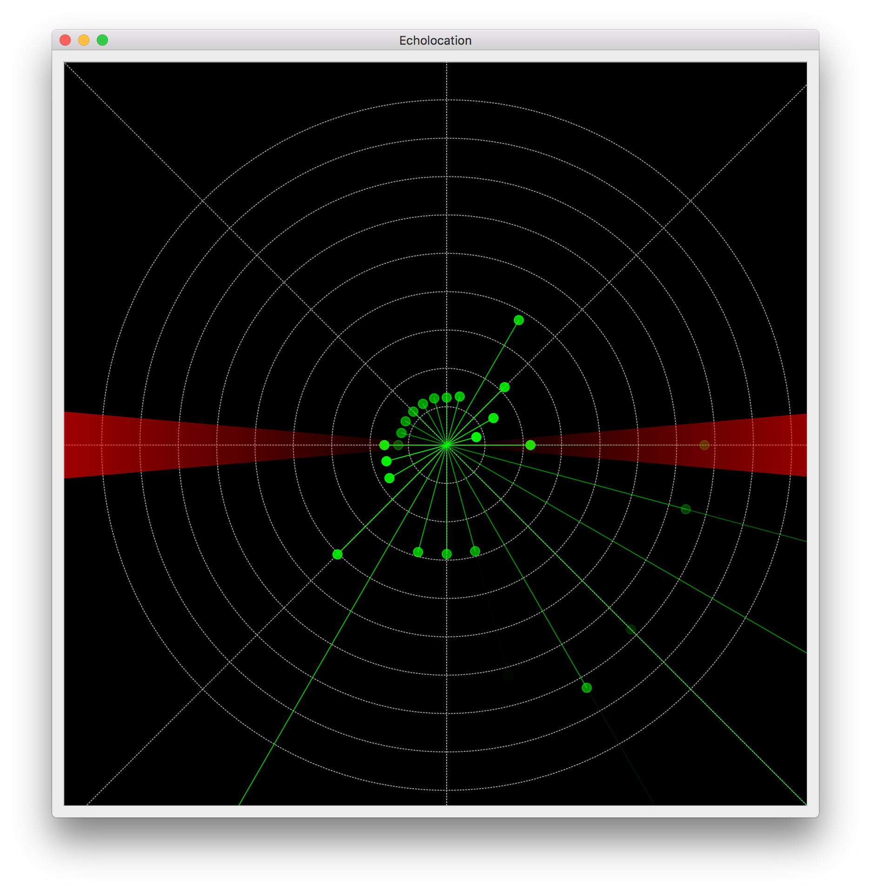

# Echolocation with Arduino
This is a result of the [2016 Connect XMAS Hackathon at Zühlke Eschborn](https://www.meetup.com/de-DE/IoT-Hessen/events/235876190/?eventId=235876190).
We built an echolocation device using Arduino, a servo and some sensors.
The Arduino is hooked up to the us-sensors, a servo motor and optionally a neopixel LED-ring to visualize the measured distances in blinky-blinky hardware.
The Arduino can be connected to other devices (like a RaspberryPi) over the serial interface.
A connected device will then receive JSON-data linewise of the form
```
{'measurements': [{'distance': 1002, 'angle': 135}, {'distance': 674, 'angle': 315}]}
{'measurements': [{'distance': 637, 'angle': 120}, {'distance': 97, 'angle': 300}]}
{'measurements': [{'distance': 201, 'angle': 105}, {'distance': 77, 'angle': 285}]}
```
with distances in cm and angles in degree.

This repository contains 
* an Arduino-Sketch to build a radar-lke echolocation device with Arduino-compatible microcontrollers, two hcsr04-sensors and a (rc) servo motor
* a PyQt-widget to visualize distances on the various angles covered by the servo motor
* CAD-Data to print a mount for the two ultrasonic-sensors



## Hooking it up


TODO wire scheme, video

## Running it on a Mac
* Hook up the hardware as "described" above.
* Connect the Arduino to your computer (USB)
* Make sure your drivers are installed and the device is available (Arduino IDE/terminal ...)
* Check the [EcholocationVisualization's README.md](EcholocationVisualization/README.md) on how to start the Qt-Gui.
* Have fun
